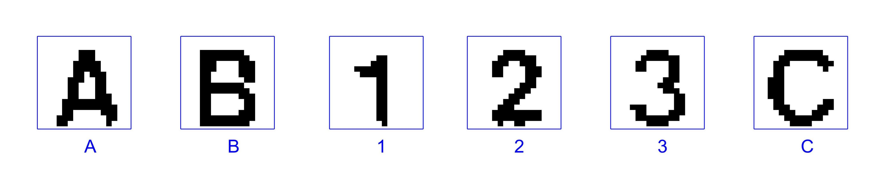

# ME5405_Project 
## Project Execution
Before execute the project, please add all folders and subfolders to the MATLAB path, and then execute the corresponding files.
- For Chromosome Image1 (`chromo.txt`), the main function file is `chromo.m`
- For Characters Image2 (`charact1.txt`), the main function file is `charact1.m`

## Classification Task 
All 3 methods K-NN, SOM, and SVM are implemented, and the source code are placed in the folder `Classification`.
### SVM
The dataset was transfered from `.mat` to `.png` with binarization operation.

run the file `Classification/SVM/SVM_Char_recog.m`, the corresponding result can be illustrated as:

<div align=center>
      
</div>

### K-NN
The main code of KNN-Classifier for execution is :
```matlab
KNN_Run_this.m
```
- To run the KNN-Classifier, the paths of the training data are needed to be changed to your local path. The 'Sample' files are the set used to train while the 'TestingSet; is used to test. The output will be the accuracy.
- The second part applies trained KNN classifier to determine the characters we obtain in the previous task as rearranged.mat. The output will be the corrsponding label of each input. 
  >Noted: The label A B C are labeled as 4 5 6 correspondingly.

### SOM

#### API:
- `Sample1` ~`SampleC` : dataset (mat.file) of each character(1, 2, 3, A, B, C).
- `Testingset`: validation set.
- `mat_file_load.m`: Matlab script to read and load the training set and validation set.
- `SOM_training.m`: Matlab script to train SOM classifier.
- `SOM_validation.m`: Matlab script to do the validation.
- `SOM_confusion_matrix.m`: Matlab script to visualize the confusion matrix.
- `SOM_testing.m`: Matlab script to test the recognization for characters in 'charact1.txt'.

#### To run the following files in sequence to realize the classification:

```matlab
mat_file_load.m
SOM_training.m
SOM_validation.m
SOM_testing.m
```
